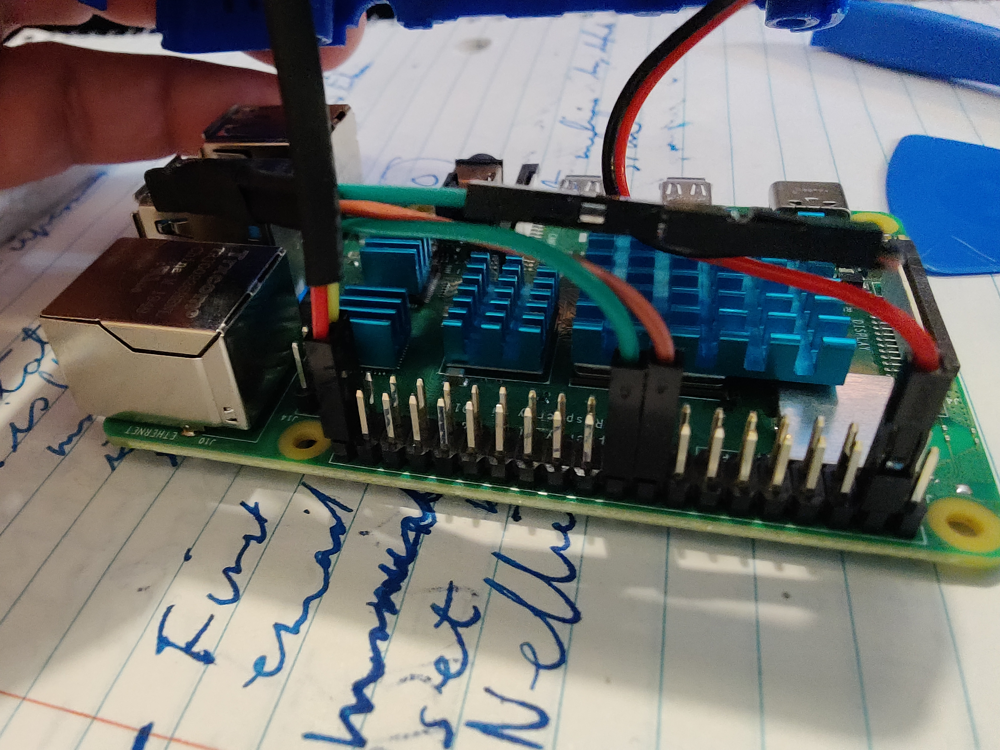

Transistor used:

- S8050
- NPN
- TO-92
- 200MA

Step 1

```
sudo cp ~/rpi-fan-service/runfan.py /usr/local/bin/runfan.py
sudo chmod +x /usr/local/bin/runfan.py
```

Step 2

```
sudo cp ~/rpi-fan-service/runfan.service /lib/systemd/system/runfan.service
sudo chmod 644 /lib/systemd/system/runfan.service
```

Step 3

```
sudo systemctl daemon-reload
sudo systemctl enable runfan.service
sudo systemctl start runfan.service
```



